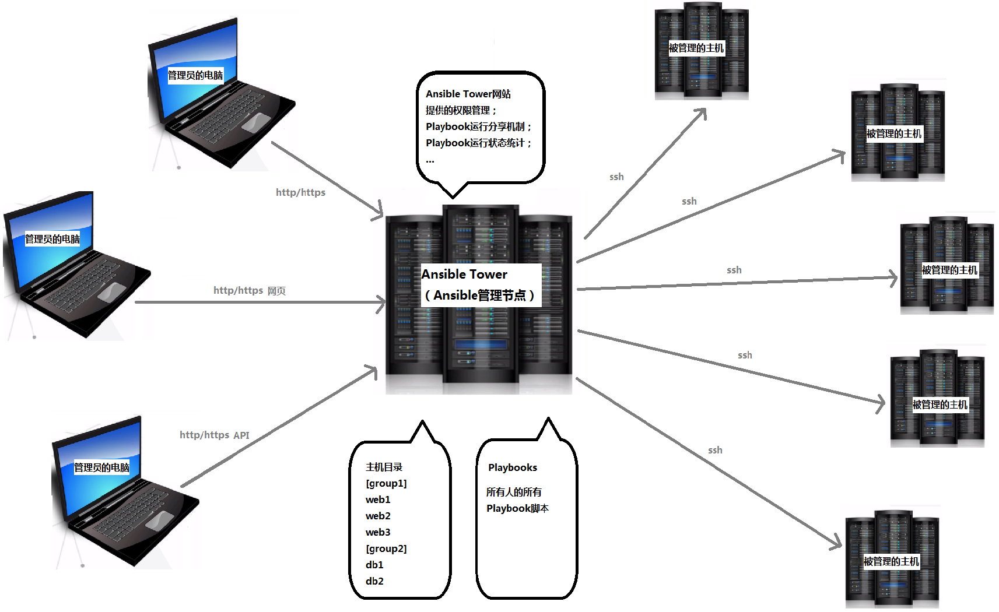

# Ansible Tower的架构

## 为什么要有Ansbile Tower
Ansilbe Tower一款针对企业级的收费软件。

在上一节的Ansible架构中和下一章Ansbile的安装中会讲到，每一台被ansible远程管理的主机，都需要配置基于key的ssh连接。个人用户自己管理几台虚拟机和远程主机不会有什么问题，但是作为企业级也用户，则满足不了业务和安全上的需求。

* 首先，每增加一台主机，都需要手工配置一下ssh连接，企业级的pc主机成百上千，每个管理员都需要在自己的电脑上配置所有的ssh连接，无疑工作量巨大。

* 还有，在安全方面如果管理员能够拿到ssh key，或者拷贝给别人，对于生产环境来说无疑是最大的安全隐患。

## Ansible Tower能做什么
Ansile Tower则是针对解决企业级用户以上两个需求的，ansible tower是中心化ansible管理节点，它向管理员提供网站页面作为接口，来运行ansible脚本playbook。

* 管理员在ansible tower上使用和分享主机的ssh key，但是不能查看和拷贝key文件。

* ansible网站所有人可以共享playbook脚本，减少重复工作。

* 此外ansible还可以收集和展现所有主机的playbook的执行状况，便于统计和分析主机的状态。

说了这么多，看下面这张架构图就清晰了：

